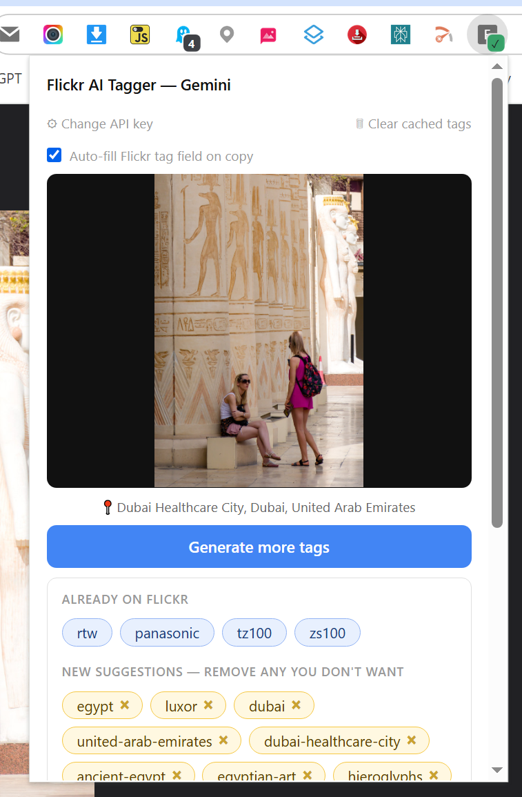

# Flickr AI Tagger — Gemini

A Chrome extension that uses Google's Gemini AI to automatically suggest tags for your Flickr photos directly from the photo page. It identifies the scene, objects, people, and location — combining three sources of location data for accurate place tagging — and lets you review and edit the tags before applying them to Flickr automatically.

## Requirements

- Google Chrome
- A free Google AI Studio API key (see below)

## Installation

1. Download the extension folder and save it somewhere permanent on your computer — Chrome needs it to stay there.
2. Go to `chrome://extensions`
3. Turn on **Developer mode** (toggle in the top right)
4. Click **Load unpacked** and select the extension folder

## Getting an API key

1. Go to [aistudio.google.com](https://aistudio.google.com) and sign in with a Google account
2. Click **Get API key** and create a new key
3. Copy the key — you'll need it the first time you open the extension

The free tier is limited to a small number of requests per day. For regular use, add billing at [aistudio.google.com](https://aistudio.google.com) — costs are very small (fractions of a penny per photo) and a small amount of credit (£10 minimum) goes a very long way.

## Usage

1. Open any Flickr photo page
2. Click the extension icon in the toolbar
3. Paste your Google AI Studio API key when prompted (first time only)
4. Click **Generate tags** — the popup can be closed while it runs; a blue badge appears on the icon while generating and turns green when done
5. Review the suggested tags — click **×** to remove any, type in the box to add your own
6. Click **Copy tags to clipboard** (or **Copy tags and send to Flickr** if Auto-fill is on)

## Adding tags manually

Type in the add tag box and press Enter or click **Add**. Tags are added one at a time. Type multi-word tags normally with spaces (e.g. `blackpool tower`) and they will be converted to the correct hyphenated format automatically.

## Tag colours

- **Blue** — tags already on this photo in Flickr (read-only, not included in the copy)
- **Yellow** — freshly suggested by Gemini
- **Purple** — tags you have added or kept from a previous generation

## Auto-fill

Tick **Auto-fill Flickr tag field on copy** to have the extension open Flickr's tag editor, paste the tags, and submit them automatically. The popup closes itself once done and the page scrolls to show the updated tags. Remember that you can use the right/left arrow keys to go to the next/previous Flickr image page.

## Google Lens

The photo in the popup is clickable — clicking it opens Google Lens search with your image as a background browser tab. When you are ready, switch to this Google Lens tab to get additional AI analysis, identify landmarks, and explore similar images. In Google Lens the 'AI Mode' will give you the best information. When done switch back to the Flickr page tab and reopen the popup which will be as you left it with all tags intact and not needing regeneration.

## Location tagging

If your photo has GPS coordinates on Flickr, the extension uses three sources to produce accurate location tags:

- **OpenStreetMap Nominatim** — reverse geocodes the GPS coordinates to get suburb, city, county, region and country. Works well across the UK, Europe, USA, Australia, and many other countries.
- **Gemini visual identification** — analyses the image for recognisable named landmarks, buildings, and places.
- **Flickr location data** — the place name Flickr has assigned to the photo, used as a cross-reference.

Gemini cross-references all three sources against what it can see in the image and generates the most accurate set of location tags it can, from specific landmark or neighbourhood level down to country.

## Firefox

Firefox support is not currently working due to differences in how Chrome and Firefox handle Manifest V3 extensions. This may be addressed in a future update.

## Notes

- The extension cannot tag photos with nudity — this is a restriction of the Gemini API.
- If tags from a previous session appear unexpectedly, use the **🗑 Clear cached tags** button.
- If the extension shows "Already generating", open the extension's service worker console at `chrome://extensions` and run `chrome.storage.local.get(null, data => { const toRemove = Object.keys(data).filter(k => k.includes('flickr.com')); chrome.storage.local.remove(toRemove); })` to clear the stuck state.

## License

MIT
